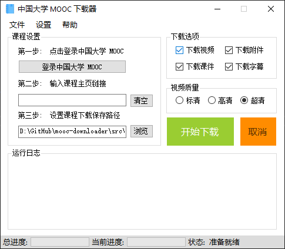
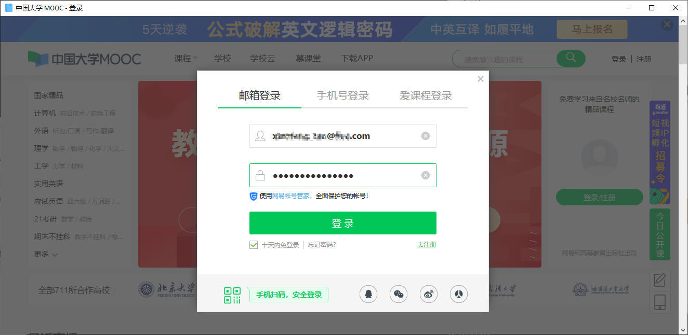
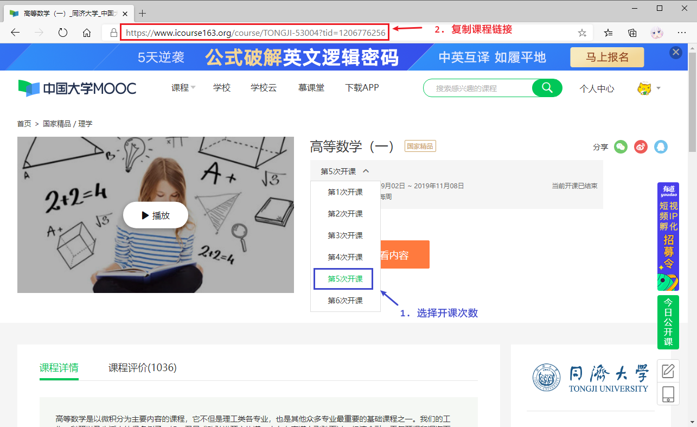
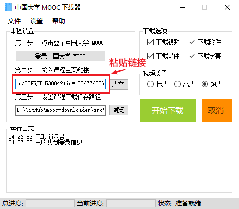
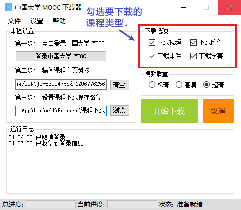
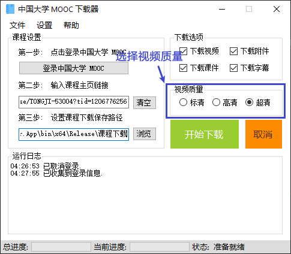
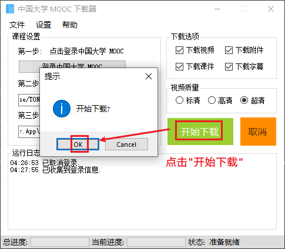

# Mooc Downloader

An icourse163.org MOOC downloader implemented by .NET.

一枚由 C# 实现的中国大学 MOOC 下载器.

## 环境依赖

### 运行

- Windows 10
- .NET Framework 4.6

### 开发

- Visual Studio 2019
- .NET Framework 4.6

## 功能

Mooc Downloader 可用于下载 `中国大学 MOOC` [icourse163.org](https://www.icourse163.org/) 课程 **视频** / **课件** / **附件** / **字幕**.

## 使用方法

- 下载本程序, 并解压.

- 运行本程序 `MoocDownloader.App.exe`, 点击 **`登录中国大学 MOOC`** 按钮, 将会弹出登录 `中国大学 MOOC` 网页, 点击 `登录` 按钮.

- 在登录页面输入账号密码, 并点击登录. 若登录成功, 窗口将会自动关闭.

- 输入将要下载的课程链接. 例如:
    
    - `https://www.icourse163.org/course/BIT-268001`
    - `https://www.icourse163.org/learn/BIT-268001?tid=1460270441#/learn/announce`

- 设置下载课件的保存目录. 默认将会保存在程序解压目录的 `课程下载` 子目录中.

- 选择要下载的类型, 可以全部一起下载, 也可以单独下载其中一种类型. 比如可以单独下载课件.

- 选择视频的清晰度. 默认为高清视频.

- 当一切设置完成之后, 点击 `开始下载` 按钮. 等待程序下载.

## 特别声明

使用本程序下载的课程, 仅可下载者自己使用, **请勿将课程分享给其他人**. 本程序开发的初衷是帮助来不及学完课程或者上网不方便的同学暂时缓存课程, 以便学习使用.
